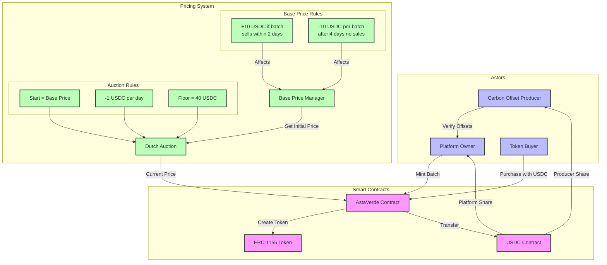

# AstaVerde

AstaVerde is a platform for trading verified carbon offsets as NFTs on Ethereum
using the ERC-1155 standard. It employs a Dutch Auction mechanism with dynamic
pricing based on market demand.

## System Overview



## Pricing Mechanism

AstaVerde uses two complementary mechanisms: Base Price Management and Dutch
Auction Per Batch.

### Precision and Calculations

The contract uses two precision levels:

- Internal calculations use 18 decimal places for maximum precision
- External prices (USDC) use 6 decimal places as per the USDC standard

### 1. Base Price Management

The base price only affects newly minted batches and adjusts based on market
behavior:

#### Time Window

- Price adjustments only consider batches from the last 90 days
- This rolling window ensures:
  - Manageable gas costs as the system scales
  - Recent market conditions drive price adjustments
  - Sufficient data points with weekly batch minting
  - Seasonal patterns can be captured

#### Price Increases

- +10 USDC for each batch sold completely within 2 days of creation
- Multiple quick sales accumulate and are applied together
- Only complete batch sales are considered for price increases

```
Example:
Initial: 230 USDC
Batch A sells in 1 day: +10 USDC
Batch B sells in 2 days: +10 USDC
Final: 250 USDC
```

#### Price Decreases

- Triggered after 4 consecutive days without complete batch sales
- Price adjustment (-10 USDC per batch) is applied once when the 4-day threshold
  is reached
- Each batch can only contribute to a price decrease once in its lifetime
- Only completely unsold batches are considered (no partial sales)

```
Example:
Initial: 230 USDC
4 days without sales
3 unsold batches (never used for decrease before): -30 USDC
Final: 200 USDC

Later:
Another 4 days without sales
Same 3 batches still unsold (but already used): No effect
2 new unsold batches (never used before): -20 USDC
Final: 180 USDC
```

Note: This one-time counting mechanism prevents market manipulation and ensures
stable price discovery alongside the Dutch auction mechanism.

#### Price Boundaries

- No upper limit
- Floor: 40 USDC

### 2. Dutch Auction Per Batch

Each batch has its own independent auction:

#### Starting Price

- Equals base price at batch creation

```
Example: Base price 230 USDC → Batch starts at 230 USDC
```

#### Daily Price Decay

- -1 USDC every 24 hours
- Continues until batch is sold or floor reached
- Once floor price (40 USDC) is reached, price remains at floor indefinitely

```
Timeline:
Day 0: 230 USDC
Day 1: 229 USDC
Day 2: 228 USDC
...until sold or 40 USDC reached
```

#### Partial Sales

- Buyers can purchase any amount of tokens from a batch
- Remaining tokens continue the same Dutch auction from the current price
- Partial sales do not affect base price adjustments

#### Independence

Batch prices decay independently of:

- Base price changes
- Other batch sales
- Market conditions

### Precision

All prices use USDC's 6 decimal precision standard.

### Configurable Parameters

All pricing mechanism parameters are configurable by the platform owner:

- Platform share percentage
- Price floor
- Base price
- Auction day thresholds
- Price adjustment delta
- Daily price decay

## User Roles

- **Producers**: Generate and verify carbon offsets
- **Platform Owner**: Mint batches, manage auction
- **Buyers**: Purchase NFTs through Dutch auction

## Development

### Prerequisites

- Node.js and npm
- Ethereum wallet (MetaMask)
- Docker (optional)

### Quick Start

```bash
# Clone and setup
git clone git@github.com:orpheuslummis/AstaVerde.git
cd AstaVerde
npm install

# Configure environment
cp .env.local.example .env.local
cp ./webapp/.env.local.example ./webapp/.env.local

# Deploy locally
npm run compile
npm run node
npm run deploy:local
npm run webapp:dev
```

### Deployment

1. Test and compile:

```bash
npm run test
npm run compile && npm run postinstall
```

2. Deploy to testnet:

```bash
npm run deploy:contracts -- --network base-sepolia
```

3. Configure Vercel environment:

- CHAIN_SELECTION
- ALCHEMY_API_KEY
- WALLET_CONNECT_PROJECT_ID

### Contract Updates

Update contract references in:

- webapp/src/lib/contracts.ts
- scripts/events/contracts.mjs
- .env.local

## Security

- Pausable if USDC depegs
- Keep environment files private

## Technical Features

### Platform Economics

- Platform commission: Configurable, defaults to 30%
- Producer share: Remaining percentage (70% by default)
- Base price adjustments as detailed in Pricing Mechanism section

### Batch Management

- Maximum batch size: Configurable, defaults to 50 tokens
- Base price: Configurable, defaults to 230 USDC
- Price floor: Configurable, defaults to 40 USDC
- Daily price decay: Configurable, defaults to 1 USDC/day
- Price adjustment delta: Configurable, defaults to 10 USDC
- Quick sale threshold: Configurable, defaults to 2 days
- Price decrease threshold: Configurable, defaults to 4 days
- Price adjustment window: Fixed at 90 days

### Safety Features

- Contract can be paused in emergency situations (e.g., USDC depeg)
- Non-reentrant protection against reentrancy attacks
- Platform funds can be claimed by owner through secure withdrawal

### Token Features

- Each token represents a verified carbon offset
- Tokens can be redeemed by owners to claim the underlying offset
- Each token has an associated producer address
- Token metadata stored on IPFS for decentralization
- Uses ERC-1155 standard for efficient batch operations
